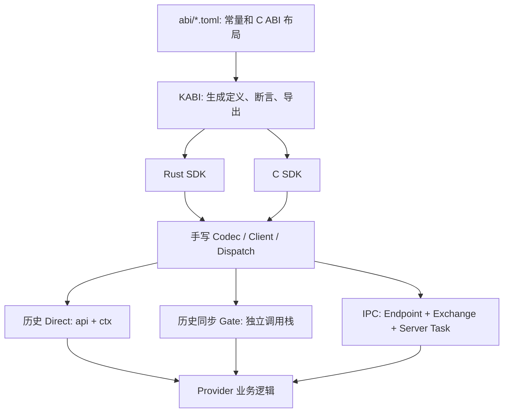

# Component 通信收敛专项审计

> 核对日期：2026-10-09。起始工作树干净，工作分支 `develop`，HEAD 与成功 fetch 后的
> `origin/develop` 均为 `2e10304c389fb6ab1b5815a97575199b62aa0c4b`。
> 本轮按 Cleanup 请求仅修改文档与测试；生产实现、schema 和生成器保持基线。
> 本文是事实与证据，不代替 architecture/interfaces 契约，也不表示整体 Cleanup 完成。
> 旧 `63384b5` 审计及旧性能表属于历史，可从 Git 历史读取；不再用其“未实现”判断现状。

交付方案见 [文件级迁移](component-communication-migration.md) 和
[KABI 小模块设计](component-communication-cleanup-design.md)。进度权威见 [STATUS](../../STATUS.md)。

## 1. 当前通信模型与真实链路

**已实现事实：** 常规启动 `init → driver_prober → virtio_blk`；virtio 的 Block
Endpoint 已 IPC-only。init 显式 grant Block 给 FatFs，创建 IPC-only FatFs 与 VFS，
grant FatFs 给 VFS、VFS 给 ksh。`ksh cat / ELF 文件读取 → VfsBinding → VFS Server
→ RemoteFs → Fat Server → C Block SDK → virtio Block Server → virtio-drivers`。
Local `/local/README.TXT` 在 VFS 内部通过 Rust 对象调用；不跨 `.kcomp`，无需 IPC。

Core bind 识别 `port=0, api=NULL, ctx=NULL` 的 IPC-only 发布：K/K 返回 Ipc=2；
私有域显式拒绝。历史发布仍是 K/K Direct、K/I、I/K、I/I Gate。原始 IPC 不自动
legacy bind；Endpoint validate/IPC submit 分别校验契约和 grant。没有新增 Binding Registry。

| 概念 | 当前职责 |
|---|---|
| Contract | ID、exact fingerprint、方法号、wire 语义；当前结构性语义仍散落手写代码 |
| Endpoint | 一次具体实例发布；staged commit、owner、活性、单调身份、不重定向 |
| Binding | Consumer 的服务引用；Block/FS 还存机制分支，VFS 仅存 Endpoint |
| Request/Reply | Core 拥有副本、receipt、终态、权限、等待和唤醒 |
| Provider | Block I/O、FS 格式、Node/Open 状态、错误转换、创建回滚与失活清理 |
| ExecutionDomain | 实际 AS/特权与可用 import；K-only IPC 不扩大 I/S 能力 |

## 2. 现存依赖矩阵

D=Direct，G=普通同步 Gate，I=独立 Server Task Request/Reply；“存在”不等于门禁全通过。

| Contract / Provider / Consumer | D | G | I | 分类与下一步 |
|---|---:|---:|---:|---|
| virtio-blk 的 block.device | 无 | 无 | 有 | 已迁移；保留设备 claim、MMIO、DMA 和驱动私有 Mutex |
| Rust BlockBinding / C kcomp_block | 有 | 有 | 有 | 三 Backend 是过渡遗留，不能当成功验收 |
| ram_blk / ram_blk_rw | 有 | 有 | 无 | 活跃测试 Provider；FS、混合 VFS 回归仍依赖，迁移后才删 |
| kcomp_domain_service 的 Block | 有 | 有 | 无 | K/I/I/K/I/I 对照；新增 IPC import 依赖已破坏隔离装载，见 §6 |
| FatFs 默认 init flags=1 | 无 | 禁止 | 有 | 已迁移路径，唯一业务 switch `fatfs_dispatch` 复用 |
| FatFs flags=0 测试实例 | 有 | 有 | 有 | 仍发布旧八项表并启动 IPC Task，三入口共存 |
| Rust/C FileSystemBinding | 有 | 有 | 无 | 仅旧八方法；拒绝 IPC binding，RemoteFs 绕过旧 frontend 使用新 wire |
| littlefs | 有 | 有 | 无 | 节点方法 ENOTSUP，无法作为 RemoteFs；原有 format/自检/读回归保留 |
| VFS / Rust VfsBinding | 无 | 无 | 有 | 已只有 IPC；Codec 与方法形状仍手写；C 只有声明头，没有 typed client |
| driver_prober → probe.result | 无表 | 有 | 无 | virtio 仍有 probe Gate dispatcher；须独立迁移结果协议 |
| kcomp_checksum | 有 | 有 | 私有 Worker mailbox | 有价值的旧机制/性能/stop 对照，Worker mailbox 不等于通用 IPC |
| kcomp_echo | 无 | 无 | 有 | test-only 真实 IPC；契约常量在手写 contract.rs，不受 KABI 管理 |
| scheduler_rr → scheduler.policy | 无表 | 专用 PolicyCall | 无 | 必须保留同步窄机制；不可等待依赖自身调度的 server |
| posix.process 退出状态观察；ksh exec/CoreTest exec消费者 | 有 | 有 | 无 | 真实普通业务Endpoint，SDK posix.rs两分支、execution.rs表/dispatch仍须迁移 |
| netstack 外部业务 | — | — | — | 未发布的业务骨架，不能算旧通道迁移完成或制造新消费者 |

## 3. 增加方法为什么要改这么多文件

生成器 `Schema` / `_build_schema` 只接受 enum/struct/alias/entry/object/const/function；
没有 method AST、wire emitter、typed client 或 server switch 生成。当前 `function`
表示 C ABI extern 函数，不能直接当 RPC 方法。16 份生成物同源检查仅防布局与常量漂移。

| 维护链 | Block | Filesystem | VFS | 机械性与业务边界 |
|---|---|---|---|---|
| ABI Schema | block.toml：三项指针表+方法常量+wire 注释 | filesystem.toml：八项表+十二方法常量 | vfs.toml：结构+十四方法，无旧 VfsApi | 布局和编号生成；方法形状未结构化 |
| Generated Definitions | generated/block.rs、C generated 头 | generated/filesystem.rs、同一 C 头 | generated/vfs.rs、同一 C 头 | 自动，不应手改 |
| Typed Client | block/client.rs 手写 read/write/capacity | filesystem/client.rs 旧八方法；RemoteFs 手写新方法 | SDK vfs.rs 手写调用参数和输出布局 | 包装可生成；chunk/cursor/close 消费规则手写 |
| Request Codec | dispatch.rs encode_lba + backend IPC to_le_bytes + C kcomp_block.c | Rust dispatch helpers + C kcomp_filesystem.c + RemoteFs | SDK vfs/codec.rs 被 client/service 共用 | LE、offset、长度可生成；同源帮助函数仍不等于方法生成 |
| Transport Adapter | backend.rs 三分支；C 三分支 | Rust/C 两分支；Remote 另 invoke | 只 ipc::service::invoke | 三机制放大人工编辑与 import 面 |
| Server Decoder / Dispatcher | Rust dispatch switch，IPC server 调用它；Direct adapter 另在 block.rs | Rust dispatch、Fat fatfs_service、little littlefs_service；Fat IPC 再加 owner/rollback | service.rs 形状 switch + 业务 switch；runtime 单独 shutdown | 解码、校验和 switch 可生成；owner/undo/shutdown 语义不可自动推断 |
| Provider | BlockDeviceProvider + virtio/两个 RAM/domain fixture | FileSystemProvider / C Fat、little 后端 | Service 对象操作、Namespace/OpenFile | 业务/错误/DMA/对象生命周期保留 |

FatFs **没有**三个独立业务后端：Direct table 与 Gate/IPC 共用 C 后端，Gate/IPC
又共用 `fatfs_dispatch`。重复主要在 SDK/协议结构搬运、两 Provider 的 C 解码和发布
方式，不能把唯一业务实现误删。VFS 已复用一个 Rust codec，不能重建 Namespace 来减少胶水。

### 假设新增 block.flush() 的编辑影响

仅分析，未定义持久化保证，也没有向生产 Block 添加 flush。

| 当前必须人工编辑的协议文件 | 具体编辑 |
|---|---|
| abi/block.toml | method ID；table field / size_ptrs；wire 文档和 exact fingerprint |
| SDK src/block.rs | trait 方法、Service::new 表字段、Direct extern adapter |
| SDK src/block/client.rs | typed flush 方法 |
| SDK src/block/backend.rs | flush：Direct、Gate、IPC 三条调用分支 |
| SDK src/block/dispatch.rs | switch arm、empty-frame 校验与 handler 调用 |
| SDK include/kcomp_block.h | C typed client 声明 |
| SDK c/kcomp_block.c | C flush 包装和三机制分支 |
| tools/kabi/kabi_gen.py | selftest 的 Block 表字段顺序与 size_ptrs golden |

这是 **8 个协议维护文件**，另需 virtio_blk、ram_blk、ram_blk_rw、kcomp_domain_service
四个 Rust trait 实现协调实现或明确 ENOTSUP；至少 client/dispatch/真实 I/O 语义测试三处。
`block/server.rs` 已转发唯一 dispatch，通常不用新增 arm；不能再计一套虚构 IPC switch。
生成文件由工具刷新，不计人工；文档及 ABI 漂移集成测试按此次 fingerprint 实际影响另计。

重构后目标：**1 个 schema + 实际 Provider handler + 语义测试**。机械文件从七个
手工 SDK/generator 编辑点降为零；整个仓库的四个 Provider 实现仍要协调，不能承诺
“只改一个业务文件”。若先生成 codec 而仍保留三 Backend，这只是中间停点，尚不满足最终标准。
当前编辑点还没有降低；本轮交付的对照右侧是设计目标，不是完成数字。

## 4. 文件系统与 VFS 事实

FatFs 已有 Root/Lookup/NodeInfo/NodeDetails/OpenNode/ReadAt，64 个挂载期借用 Node
槽、8 个独立 FIL open。Node 没有 per-node owning lease；unmount 永久失效旧身份。
Open 归 verified consumer Component+Task，创建的回复取消/退出则回滚；后续请求 reaper
回收已交付但 owner 死亡的 open。不是 Core 文件对象，也不保证空闲时立即清理。

VFS 只有一套 LocalFs/RemoteFs/FsNode/FsOpen/Namespace/Path/OpenFile；Remote close
用八个预留槽，Drop 不 park，server 请求后 drain。service.rs 自持 32 Path / 32 Open
引用预算与 Undo；runtime.rs 负责 envelope、verified caller、reap、reply、drain 和控制
shutdown。可生成的是形状校验与标量布局，不能生成 Undo 或让 Core 知道 Node。

littlefs 仍用旧路径 open，root/lookup/node_info ENOTSUP； mount 失败才 format，
非每次无条件重格式化。两个实例和介质隔离是真实现。ksh 的 cat 与 ELF snapshot 都走
VFS；POSIX已有process退出状态Direct/Gate observer，普通业务清单必须迁移它；应用运行期通用文件 fd 仍未接线，ELF 文件加载成功不证明 read syscall 接 VFS。

## 5. Core、状态复杂度与删除门槛

当前 EndpointRegistry + Component Registry + Exchange + TaskTable 四份相关真相，
IPC 主提交锁序 registry → endpoints → exchange → task table，醒目标在解锁后执行。
Exchange 是新增的一把全局锁，未增加 channel/connection registry；wait 图从 pending
请求推导，不另存通用依赖图。预算：16 请求、32 listener、每 listener 16 grant、
每 Endpoint 四占用槽，单槽 1024 字节 request/reply 复用 storage，共 16 KiB payload。
Task 栈 16 KiB；这不是全部常驻开销，listener/metadata/栈另计。

owner 或真实创建祖先可 grant；Registry::created_by 沿 immutable creator 链，ID
单调约束避免环。创建关系不是资源 owner 或隐式 send 权限，grant 仍须显式安装。
reply/cancel/close 首个终态胜出，accepted cancel 保留 receipt，晚 reply 退役并返回
ECANCELED；业务创建回滚由服务端负责。Task exit / fail / stop 有 Exchange hooks。

Mechanism::Direct/Gate、api/ctx、has_direct_exports、endpoint_call 仍有真实消费者。
删除它们前必须完成 §2 的普通业务迁移，并真实验证 I Task / AS copy / imports。
policy/IRQ/create/destroy 的不可 park 边界、panic containment、AS 切换、owner/device/DMA
和 backing 驻留不能删。删除 Direct 不会自动证明 DMA 静默或 Native 物理回收安全。

## 6. 本轮真实门禁与已定位回归

所有以下命令以本轮源码运行；历史成功日志没有充作当前通过证据。

| 命令 / 验证层次 | 结果 |
|---|---|
| make abi-gen、make abi-check | PASS；16 生成物无变化，KABI selftest 通过 |
| make fmt-check | PASS |
| make check | FAIL：Block backend.rs:123/154 被 Rust 1.98 clippy chunks_exact_to_as_chunks 拒绝；后续全门禁未执行 |
| make test-host | FAIL：Core 573 passed / 1 failed / 6 ignored；scheduler_policy_contract_is_reserved_from_generic_calls 返回 NoDispatcher，预期 ReservedContract |
| 独立 SDK cargo test（基线） | 链接失败：缺 kcore_ipc_submit/collect/wait/cancel 的 cfg(test) 替身 |
| 独立 SDK cargo test（本轮 test-only 修补后） | PASS，94 项；新增替身明确返回 ENOTSUP，不模拟真实 Exchange |
| 独立 VFS cargo test | PASS，6 项生产对象/服务语义测试 |
| make test-tools（含相关 C Provider/SDK 测试） | 完成；新增 envelope 测试 3 passed / 1 expected failure；后者明确不是通过 |
| make test-qemu | FAIL，首个 RV64 default 阻断聚合；另单独运行 RV32 default、no-block 和 init 补齐证据 |
| RV64 CoreTest default / no-block | default 101/104：driver-attach、driver-multi-device、service-scenarios-completed 失败；no-block 103/104：service-scenarios-completed失败 |
| RV32 CoreTest default / no-block | default 88/90：两个 driver 检查失败；no-block 90/90，runner shell 流程 PASS |
| make test-init | PASS：RV64 fat/dual-fat/oom/no-block/bad-fat；RV32 fat/dual-fat/no-block/bad-fat；含 cat、双盘、Local/Remote 路径、RV64 ELF exec |
| make test-arch；另补 RV32、SMP 子目标 | RV64 42/43、RV32 42/43：均 isolated-domain-service FAIL；RV64 SMP 3/3 PASS |
| 私有 RV32 S-mode NoMMU profile | 构建并运行，default 88/90；IPC 和 hybrid 分组通过，但整体 driver 失败，不能标整套 PASS |
| SandboxedNative | 未实现；显式拒绝部署测试不等于 Sandbox IPC 验证 |

定位及可由人类手写的最小修补（尚未改生产）：

1. Core call::prepare 的 IPC-only 拒绝放在 reserved policy 检查前。原 policy 发布也是
   port=0/null/null，因而抢先返回 NoDispatcher。先检查 reserved contract，再检查
   ordinary IPC-only；同时约束 policy 不能被当 IPC listener。保留 EPERM 与无 inflight 副作用测试。
2. driver::report 在 CoreTest create 锚点调用 attach_serves；容量/读已换 IPC，必须
   从 owned Task 发起，当前 caller() 明确拒绝锚点。改测试编排：Task 写结果，退出后锚点
   报告；不放宽 IPC 的真实 Task/principal 检查，不退回 virtio Direct。
3. 三 Backend 的 Block client 令 kcomp_domain_service 工件实际 UNDEF 中包含四个
   IPC import；I loader 白名单拒绝，因此 CoreTest 部署和 ArchTest 同时失败。短期应
   分离 legacy 测试 adapter 的可链接依赖，不能仅放开白名单；长期由 Phase D 真实 I IPC 替代。
4. Rust Request::decode 未检查 bytes.len() > MESSAGE_MAX，C decode 有此检查。
   新测试复现 1025 字节差异，以 expectedFailure 明示；Core submit 已挡 oversized，
   所以这是 decoder 校验漂移，不宣称已发现跨域利用。补相同上界并去掉 xfail。
5. SDK host 缺符号已由 test-only ENOTSUP 替身解决；这仅恢复已有 SDK 测试链接，
   不解决生产 I import，也不构成 Block IPC 分块行为的 mock 证明。

日志 `/tmp/kaleidos-cleanup-{abi-gen,abi-check,check,host,sdk,sdk-final,vfs,tools-final,
qemu,qemu-rv32,init,arch,arch-rv32,smp,nommu,codec}.log`；guest 原始日志在
`build/tests/*/logs/`。两处是临时工件，本文保存结果，命令可重跑。
新测试见 [test_ipc_codec.py](../../tests/build/test_ipc_codec.py)：编译真实 C/Rust SDK
source，独立 Python LE golden 检查 Echo envelope 与 Block read 参数；不复制生产 codec。
其 mock 只替换 transport，不证明跨 CPU、私有 AS 或 generated method codec 已存在。

## 7. 当前性能对照

QEMU 10.0.11、release、10 MHz timebase、trace_mask=2047；4 warmup、31 batch、
32 次/batch，表内是**整批 ticks** median / p95，不能直接当单次精确延迟。
RV64 IPC server 在另一个 CPU；RV32 同 CPU。此次多个验证进程并行，host 抖动影响
数字，只作方向性样本，不作跨版本性能门禁或 transport 单因素实验。

| arch | bytes | Direct | Gate | IPC Request/Reply |
|---|---:|---:|---:|---:|
| RV64 | 0 | 10 / 14 | 928 / 997 | 16105 / 19000 |
| RV64 | 8 | 25 / 29 | 979 / 1127 | 16126 / 19019 |
| RV64 | 64 | 26 / 26 | 970 / 1040 | 16654 / 25783 |
| RV64 | 512 | 53 / 53 | 995 / 1058 | 17081 / 22821 |
| RV32 | 0 | 9 / 13 | 598 / 619 | 6549 / 6647 |
| RV32 | 8 | 22 / 23 | 612 / 637 | 6521 / 6599 |
| RV32 | 64 | 27 / 27 | 620 / 629 | 6549 / 6585 |
| RV32 | 512 | 76 / 77 | 679 / 704 | 6772 / 7085 |

512 字节 batch median 的 IPC/Gate 比约 RV64 17.2、RV32 10.0；IPC/Direct 约
322、89。语义成本不同：IPC 包含拥有副本、真实 Task 等待/唤醒与 RV64 跨 CPU。
不能把这些 QEMU 比值推广到真机。当前四次 payload copy、通用锁/查询、RR park/switch
和每 512 字节一请求是**待测瓶颈假设**，不能靠延迟表断言各自占比。

没有 Block 吞吐测量，不能给出 MiB/s 或“性能无回归”。下一轮先串行 trace-off
测同 CPU/cross CPU、512/多扇区吞吐及 CPU 占用，标 provider 轮询和拆分次数；再考虑
共用同一 generated handler 的透明 local dispatch，不恢复另一套跨组件 function table。

## 8. 规模、维护点与测试负担

历史 `63384b5 → 2e10304`：按 git numstat 文件路径分类，生产目录手写源码
+3908/-645（净 +3263，**含内嵌 cfg(test) 与注释，并非纯生产语句计数**），生成物
+235/-147（净 +88），独立测试 +1223/-22（净 +1201），文档/构建/其他 +948/-215。
这是历史实现的增加，不是本轮 Cleanup 删除收益。

本轮生产逻辑、生成代码、Core registry/状态/锁净变化均为 **0**；新增内容是专项文档、
实际 codec 测试及 cfg(test) 链接替身。没有减少 Backend，也没有减少普通 Gate 消费者。
patch 行数用交付提交的 `git show --numstat` 复算，包含 untracked 新文件后才有意义。

本轮文件级统计：测试 +241/-0；文档 +620/-259（净 +361）；生产逻辑与生成代码 +0/-0，Core新增状态/锁为0。

| 指标 | 当前实测/核对 | 收敛目标（未实施） |
|---|---|---|
| flush 协议人工维护文件 | 8，另 4 provider + 至少 3 语义测试处 | 1 schema；handler 与测试仍手写 |
| Block Client 路径 | Rust 3 + C 3；Rust共享一个 Gate/IPC dispatch | 各语言一个生成 IPC frontend/dispatcher |
| FS 协议入口 | Fat legacy table/Gate/IPC，little table/Gate | 每 Provider 一个 IPC server |
| Core 通信真相/锁 | EndpointRegistry + Exchange；其提交涉及已有 registry/TaskTable | 不新增 registry；替代完成后删 legacy 指针/调用记账专用负担 |
| VFS 对象模型 | 一套 Namespace/OpenFile，Local + Remote | 保留；仅 wire 搬运改生成 |
| 新服务概念 | 开发者仍需理解 table/Gate/IPC 和手写 frame 形状 | Contract/Endpoint/Binding/Handler；授权与生命周期不能隐藏 |
| 测试重复 | SDK Direct/Gate 分支、两个 C FS decoder 与新 IPC 行为并存 | 保留语义/失败/隔离证据；删除仅旧分支细节测试 |

## 9. 文档漂移与阶段结论

已修正文档：STATUS 仍称 VFS create/SDK/Remote/exec 未实现；旧 audit/migration 把
Phase 3 当未来；README、deployment 漏 IPC-only bind；hybrid ADR 错称 virtio 仍旧绑定；
filesystem 接口页把 namespace 当空骨架。旧里程碑另加历史标记，不用其旧 PASS 覆盖本轮失败。
未修改 AGENTS 的稳定规则。

本轮 Phase A 已完成；Phase B 仅设计与生产 envelope 字节证据，**method generator
未实现**；Phase C 基线已有 virtio/Fat/VFS 主链，但 RAM/little/legacy clients/probe/posix.process
尚未收敛；Phase D 私有 Task/IPC/copy 未实现；Phase E 旧业务机制未退出；Phase F 已
同步相关文档和补测试，不能替代 B–E。最终验收条件目前不满足。

优先级：先修复上述基线门禁与 import 耦合；再用 Echo + Block read 小 patch 验证
schema→C/Rust client/dispatch；随后 RAM/FS/little/probe/posix.process 逐组迁移，补 I IPC，再删旧业务
机制。详细改动边界、回退点、保留理由见迁移计划，不进行一次性 ABI/Core 重写。
