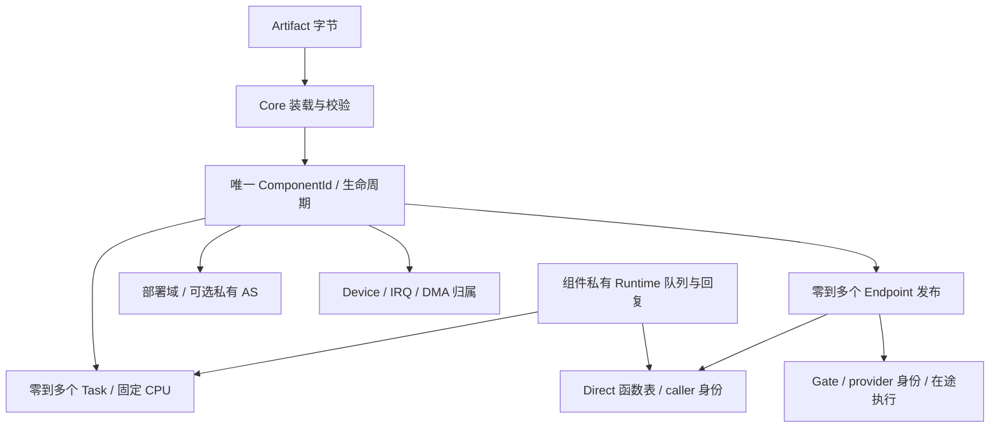

# Core Responsibility & Invariant Audit

本页是 2026-10-08 对 develop 的审计与验证记录，不取代架构契约。
基线：`01ee7c21b86bb362a7e14fdc687ce56c820e33c0`。代码修改获本次任务明确授权。

## Phase 0：事实与职责

| 状态 / 记录 | 保存的事实、修改者与真实消费者 | 重复性 / 必要不变量 | 结论 |
|---|---|---|---|
| `component::Registry` / `ComponentRecord` | Core loader 与生命周期编排写 id、状态、域、AS、loaded、opaque state；调度、调用、资源入口与 monitor 读 | 唯一实例生命周期；id 不复用，失败恢复创建新 id；state 指针不是 Core 所有的堆对象 | 必须保留 |
| `LoadedComponent` / image backing | loader 校验入口、重定位、ABI，实例记录持有驻留 backing | **没有 ComponentImageId / ImageTable**；当前 loaded 与实例 1:1；同一 artifact 多次放段，data/bss 独立 | 保留，不新增共享镜像身份 |
| `EndpointRegistry.endpoints` | Core 提交发布、失效；Gate / bind 读 owner、port、contract、ABI、api/ctx | endpoint 是一次发布，不是另一个 Component；单调 id，旧发布不重定向；只读 SDK handle 不另存存活真相 | 必须保留 owner / 存活 / 执行入口 |
| `contracts` | 首次发布确定 kind / exact ABI，后续发布校验 | 是跨 provider 的 ABI 一致性，不等于 endpoint；诊断 name 无消费者 | 保留一致性校验；删无用 name |
| `names` | Core 提交 `(provider, port_name) → EndpointId`；显式 discover 与 observation 读 | 是派生发现索引；其中 contract 与 endpoint 重复 | 简化重复字段；目录整体暂留 |
| `pending` | create 中 stage，成功批量 commit，失败 discard | 尚无 endpoint id，与 Live/Invalid 不是同一事实；内部 Pending 状态没有构造者 | 保留 staging，删不可达内部状态 |
| `ComponentRecord.inflight` | Gate、policy 准入 / 完成写；Isolated 单栈并发检查读 | 计执行，不计 Direct；原 Stop 不读它 | 必须保留并接入 Stop；复用保护 IRQ |
| `TaskTable` / `TaskRecord` | Core 创建、start、park/unpark、switch commit 写；策略只读快照 | owner 创建后不变；state、home CPU、permit、context、stack 是执行真相；组件 owner 与 task owner 是实例和从属执行流两个事实 | 必须保留 |
| scheduler per-CPU state / `PolicySlot` | Core 持有 current、anchor、IRQ 返回现场、活动 policy endpoint、栈与 busy；scheduler 只提出候选 | task Running(cpu) 与 current 是提交后的执行投影，不能随意删；policy 的栈串行占用不是组件业务锁 | 保留，未发现本次须重写的证据 |
| `RequestContext` / per-CPU containment / current create | Core 边界解析 ambient principal 与 caller-task provenance | Direct 保留 caller 身份，Gate 切 provider 身份；loader fallback 与 guard 是临时执行现场，非第二个 owner 表 | 保留；修正 token / Registry 占位注释 |
| `DeviceTable` | Core claim/release/quarantine，IRQ/DMA 读 | 设备存在性来自不可变 MachineInfo；owner 与 quarantine 是独占 / 复用真相，不重复固件描述 | 必须保留 |
| `IrqTable` | Core 注册/撤销 `(device, resource_index)` route；trap 读 | owner/handler/ctx 是投递事实；取出后仍可能执行，撤销不是回调 drain | 保留，补生命周期准入与在途保护 |
| `DmaTable` / `QUARANTINE` | Core allocation owner、mapping device owner、单调 mapping id；驱动与 failure 使用 | allocation 与 mapping 不同；无 IOMMU / 静默证明时 backing 不复用；普通借入 buffer 未 pin | 保留，修 map 与 device release 竞争；不新增 DMA framework |
| buddy / slab / `MemoryLease` | Core 分配占用与 RAII；loader、栈、页表、heap 后端使用 | 无 region owner / malloc 账本；SDK HeapState 是业务实例自己的 free list，不重复物理分配真相 | 必须保留 |
| `AddressSpaceManager` / handle / mappings / shared root plan | Core 建立 owner、generation、Ready/Retired、权限与 backend；Isolated 和用户执行使用 | 实例 AS handle 是归属关联，AS 表是映射真相；generation 防 stale，shared/exclusions 是实际别名维护 | 必须保留；无远端 shootdown，不能声称完整 SMP AS 回收 |
| SDK `Endpoint<C>` / typed binding / C 与 Rust ABI | SDK 缓存已选机制与类型；schema 生成声明与布局断言 | 不是第二个 registry；C/Rust 唯一来源已是 `abi/*.toml` | 保留生成链，不再另造 ABI 源 |

业务服务名称、provider 选择、RequestId、队列、reply 匹配、取消与并发语义可以外置。
现有 endpoint 目录有真实的 init/ksh/SDK 消费者；本轮不复制成 ServiceManager，也不在
没有迁移原型时拆掉目录。调度契约是 Core 自己消费的机制，保留专用 policy 边界。



## 已确认问题与边界

| 问题 | 代码证据 | 本轮处理 |
|---|---|---|
| Stop 可越过无 owned task 的正在执行 Provider | exit 只查 Task；call 在 registry 中已有 inflight | 同锁检查在途计数与提交 Stopping |
| Direct ctx 可被 destroy 释放 | bind 交付裸 api/ctx，无 unbind；C FS destroy 释放实例状态 | 依据已发布 Direct table 保守拒绝 destroy，不靠代码驻留推导 ctx 安全 |
| IRQ 取出回调后可与 destroy 竞争 | on_irq 锁外调用，route_of 不查实例状态 | 共用实例准入 / 在途计数，不持锁执行回调 |
| DMA map 与 device release 之间有插入窗口 | dma::map 在插入 mapping 前 drop(device_table) | 保持 device→dma 锁序到插入完成 |
| bind 把未实现的 K/I→Sandbox 判断成 Gate | select_mechanism 返回 Gate；dispatch 却 ENOTSUP | 绑定时直接拒绝全部 Sandbox 组合 |
| Resolved 注释暗示已解析依赖 | load 没有 requires / runtime dependency resolver | 说明是装载后、create 前阶段；未实现能力另列 |

零 Task 的被动组件合法；多个 Task 的组件合法；Direct 与 Worker 可以共存，组件自己
负责同步。当前没有“多个实例共享一份已重定位 loaded image”的机制，只有同 artifact
多实例。Isolated 的栈 / AS / ABI 窗口由 Core 建立，业务 instance_state 由组件写回；
单栈入口跨 CPU 串行，Isolated Task 与设备 API 未接通。

Failure 阻断后续调度 / Gate；另一个 CPU 已运行的 KernelNative 代码仍可运行到下个
协作边界。Direct 不切身份、不容纳 provider panic，已持有表不可撤销；必须保持 ctx
存储，组件不得自行释放暴露对象。IRQ release 不证明在途回调已返回。

DMA map 的实现锚在 **device owner**，忽略 ambient ctx；unmap 不解析 caller。这为
现有 VirtIO Direct 服务提供归属，但与 driver-model 的“非 owner map 被拒”文字冲突。
普通 buffer 未做 pin，failure 的资源获取门禁与实际资源插入也没有一个全局事务。
本轮不把这些边界改写成已解决，不靠调整 getter 测试声称权限或 DMA 隔离。

## 分阶段交付与验证

Phase 0 只建立本审计；基线纯 Core host：502 passed、5 ignored（忽略项不是通过）。
后续阶段的变更、命令、规模与实际结果在完成后追加。

## Phase 1：正确性

- Stop 在 registry 准入锁内检查在途执行、Direct 发布与 live Task，再提交 Stopping；
  Gate、policy、IRQ 后续准入均被阻断。组件代码在锁外执行。
- IRQ 复用 inflight，允许 Starting/Ready；回调已取出后撤销 route 不会丢失在途事实。
- Native 发布非空 Direct table 即保守拒绝 destroy，包括 Invalid endpoint 的旧表；
  无新增 pin/refcount 表。Isolated 的表从未通过跨域 binding 外借，不受此限制。
- DMA map 保持 device 锁到子 mapping 插入完成，device release 不能漏掉新子项。
  不改变现有 device-owner 归属与无 caller 的 unmap 规则。
- 唯一新增 ABI 是 `kcore_component_stop(id)`：已有生命周期机制的窄导出，实际消费者
  是 CoreTest 的跨 CPU Stop/Gate 竞争与普通组合方 teardown；不提供测试后门。
  ABI 60→61，exact fingerprint 协调替换，所有旧工件需要重建。
- Core host 507 passed / 5 ignored；`make test-host` 成功（含真实工件 kernel 554
  passed / 6 ignored）。host 竞争检查只证明锁与状态机，不证明 SMP 硬件执行。
- 串口 smoke 的 `unload littlefs` 现在验证 DirectExports 拒绝；多 FS 存活时 ksh cat
  验证现有 ambiguity 拒绝。FAT 文件内容仍由 CoreTest 与普通 init smoke 验证。

## Phase 2：收敛

删除 `ContractRecord.name`（首次发布的端口名被误当契约标签，无消费者）、
`EndpointName.contract`（与 endpoint 相同事实）、内部 `EndpointState::Pending`
（stage 尚无 endpoint id）。必要职责分别由端口名称索引、EndpointRecord、pending
publication 承担；减少两个重复字段与一个不可达状态，不改变隔离边界或 Direct 路径。
公开 wire Pending 编码暂保留用于已有观测 ABI，不声称有生产状态构造者。

KCOMP_ABI 同时生成 C 常量；三个 C provider 与四个无 SDK runtime 的 ArchTest fixture
引用生成物，删除七处需要协调手工同步的生产指纹。Rust fixture 只编入声明，仍无
新 UNDEF/import。独立的 known-answer 测试保留，职责与生成源不同。

Sandbox bind 全部拒绝 ENOTSUP，删除 K/I→Sandbox 的假成功分支；Resolved 与
ComponentId 注释不再暗示已存在 requires resolver、凭证 token 或 ResourceDomain 表。
没有新增 ServiceManager、RPC subsystem、绑定 registry 或 Runtime crate。

本阶段 `make test-host`、RV64 boot-build、RV32 boot-check 成功；纯 Core host
507 passed / 5 ignored。构建使用系统 host linker，避免本机 Nix cc / glibc 混用。

## Phase 3：形态验证与实验发现

`tests/kcomp_checksum` 是一个 test-only 镜像，不是通用 Runtime crate。同一 create
入口读取 config，所有模式只拥有普通 ComponentId、opaque state 与 owned Task：

| 形态 | 状态 / 执行 | 实际验证 |
|---|---|---|
| Passive A/B | 两个实例，各有独立 mailbox / Direct counter，零 Task | task 总数不变、ctx / mailbox 不同、A 调用不改 B；发布后 Stop EBUSY，旧 ctx 仍可用 |
| Active | 一个 provider-owned Worker，单槽 Runtime Request/Reply | 64 次原子发布与回复、拒绝覆盖已预留槽；业务请求不进入 Core |
| Hybrid | 同一个 state / endpoint / Worker；同时 Direct checksum 与 Runtime 请求 | 64 次 Worker 回复与 64 次 Direct 调用；RV64 Worker CPU1 / Consumer CPU0，RV32 同 CPU 协作 |
| Gate-only probe | 零 owned Task，api=NULL | RV64 consumer Task 在 CPU1 执行 provider Gate，CPU0 Stop EBUSY 且 Ready；释放后 Stop 成功、旧 endpoint 拒绝、重新创建身份不同 |

mailbox 的 C-layout u32 全部用 AtomicU32::from_ptr；Acquire/Release 发布请求 / 回复，
计数独立原子更新。不输出 Rust atomic layout，不为组件自动造锁框架。
Consumer 对 provider Worker 执行 unpark 得到 EACCES，Direct 不改变 Task owner。
Worker 的 exit 是组件自己的决定，退出不销毁实例；Direct 发布的实例与 state 驻留。

B/C 只使用现有 Task / yield；没有 Core RequestId、队列、reply 或 waitqueue。
原型限定单 consumer、一个请求槽与受信 Native 共享地址空间；错误路径有超时。
跨 owner wake、通用取消 / Task join 和私有域 Worker 尚不可据此宣称完成。

实验实际发现 RR 的旧“cursor += 1，取候选下标模 N”在候选排除 outgoing 时会饿死
三个 Runnable 中的一个。修复仅在 scheduler_rr：原有每 CPU 游标保存上次 TaskId，
选择升序候选的后继、尾部绕回。不改 Core 候选 / 提交 / 调度 ABI，不新增状态。
原型仍保留三个同时 Runnable 的任务，没有通过顺序停止 Worker 绕过问题。
Host 的动态候选回归检查与真实 RV32 Hybrid 场景均通过。

ArchTest `isolated-domain-service` 原来要求 Native Direct provider 可销毁，现在验证
DirectExports 拒绝；Isolated destroy / satp 恢复仍真实执行。ksh endpoints smoke 检查
驻留 FS 的 Live，而不依赖被拒绝的 unload 产生 Invalid；stale 由生命周期用例证明。

## Phase 4：删除与文档对齐

| 删除 / 合并项 | 原用途与必要职责的去向 | 状态 / 不变量变化 | 执行域 / 性能 / 验证 |
|---|---|---|---|
| Contract 诊断 name | 无消费者；端口名仍在 names 索引 | 少一个重复字段，不改 exact kind/ABI 规则 | host 发布 / bind / 发现；Direct 路径不变 |
| names.contract | 与 EndpointRecord.contract 同一事实；discover 从记录核对 | 少一个需要同步的事实 | 所有错误 contract / dead / no-redirect 用例保留 |
| 内部 EndpointState::Pending | 从未构造；pending publication 仍负责 create 事务 | 少一个不可达状态，未删 staging | host batch 原子性 / abort；wire Pending 编码暂留 |
| invalidate_endpoint | 只有 host test 调用，生产只按 provider 生命周期失效 | 删除独立端口失效入口；保留 invalidate_provider | tests 改走实际 provider 路径，删除重复单项失效测试；未增加组件 unpublish ABI |
| endpoint_count / live_count 生产可见方法 | 只有 batch / tombstone host assertions 消费 | 改为 cfg(test)，观测仍走公开 nth 值投影 | 无生产 API 调用路径变化 |
| C / 零 SDK fixture 手写指纹 | 原来七处手工协调；改引用 schema 生成的 KCOMP_ABI | 减少七处重复真相；known-answer pin 仍独立 | ABI generator、C 编译、packer 零 UNDEF 与真实 Isolated 装载 |
| RR 下标游标 | 原为轮转提议；同一个字段改存最后 TaskId | 不加表 / 状态，删除对快照位置稳定性的假设 | 策略 O(N) 找后继；Core 候选扫描本就 O(N)，无新增 Core 开销；host 动态快照与 QEMU Worker 验证 |
| 过时迁移清单与注释 | 仍要求已完成的 typed binding、task arg，暗示第二张 binding 表 | 文档分别链接实际唯一真相，不产生代码分支 | 对齐 deployment / lifecycle / driver / module / STATUS |

本轮没有把一个既有 Core Service Registry 外移后再留一份副本；**实际外移项为零**。
目录 / provider 选择在原则上可外置，目前因真实消费者保留；实验的 Request/Reply
从开始就只存在 test Runtime，不能算“从 Core 外移”成果。

## 修改前后的关键不变量

| 基线 | 现在 |
|---|---|
| Gate 准入有在途计数，Stop 只查 owned Task | 同一 registry 锁完成 Ready 检查、live Task / Core-managed 执行检查与 Stopping 提交；准入先赢则 Stop Busy，Stop 先赢则新调用拒绝 |
| 代码驻留，但 destroy 可释放外借 Direct ctx | 已发布非空 Native Direct 表即拒绝 destroy，Invalid 旧发布也算；Failed 不析构，不承诺撤销旧裸指针 |
| IRQ route 取出后只剩锁外函数指针 | 取出 + Starting/Ready 准入 + inflight 同事务；route release 后在途仍可见，返回才归还 |
| device 锁先释放，再插入 DMA mapping | device→dma 持锁到插入完成；release 查子项与新 mapping 不再错过彼此 |
| K/I→Sandbox bind 可返回 Gate，调用才拒绝 | Sandbox 全部组合 bind 即 ENOTSUP，无降级 |
| RR 游标假设候选位置稳定 | TaskId 后继轮转，不依赖 outgoing 排除后的下标稳定性 |

未改变：ComponentId 不复用；独立 loaded backing；Task owner / 初始 CPU 固定；
Direct 保持 caller 身份，Gate 带 provider 身份与 caller-task provenance；Task 与
不可 yield 的同步 Gate 栈仍是不同执行上下文；所有组件代码在 Core 锁外执行。

## Core API 与规模

Core 导出 ABI **60 → 61**：唯一增加 `kcore_component_stop`，复用既有生命周期，
有真实 CoreTest consumer。**没有删现行导出**，没有新增 RPC、业务目录、RequestId
或 AS 调度 API。内部删除一项失效方法、两项只在测试需要的生产方法；不能将其
计入 ABI 减少。exact KCOMP_ABI 从 `0x47AF93E621B8D054` 协调替换为
`0xB1365C28A47DE092`，陈旧工件需重建。

下面统一统计递归 `.rs` 的物理行，**包含注释、生成物与 cfg(test)**，不是运行时
LOC 或二进制大小；before 来自本页基线，after 为最终收敛代码。Core 没有实现总
LOC 下降，增长主要是正确性门禁 / ABI 与回归测试；减法按上面的状态和入口计。

| 模块 | before | after | 差值 |
|---|---:|---:|---:|
| Core src 总计 | 39145 | 39360 | +215 |
| component | 16903 | 17039 | +136 |
| task | 2722 | 2722 | 0 |
| sched.rs | 2430 | 2432 | +2（仅 host fixture 换失效入口） |
| resource | 2265 | 2266 | +1 |
| memory | 4606 | 4606 | 0 |
| irq | 326 | 396 | +70 |
| SDK | 9670 | 9678 | +8（生成声明） |
| scheduler_rr | 286 | 297 | +11 |
| CoreTest | 2744 | 3065 | +321 |
| test-only Checksum（新镜像） | 0 | 216 | +216 |

## 实际验证与证据层次

所有构建 / host 命令使用 `CARGO_TARGET_X86_64_UNKNOWN_LINUX_GNU_LINKER=/usr/bin/cc`。
第一次构建的 E0463 来自本机 Nix cc 生成的 proc-macro .so 需要高于宿主的 glibc；
改用系统 host linker 后通过，没有修改系统 feature / resolved profile。

| 层次 / 命令 | 实际结果 | 能证明什么 |
|---|---|---|
| `cargo test -p kernel --lib` | 506 passed / 5 ignored | 生命周期、128 轮锁竞争、IRQ 准入、endpoint / 资源纯逻辑；不执行真实组件入口 |
| `make check` | PASS；含 fmt、clippy -D warnings、ABI/Kconfig/build/harness 工具自测、workspace / SDK、交叉构建 | 真实 fixture kernel 553 passed / 6 ignored；arch host 69 / 2 ignored、SDK 85 passed、RR 5 passed。ignored 不计通过 |
| RV64 boot-build / RV32 boot-check | PASS | RV64 S-mode/Sv39 可链接；RV32 S-mode/Sv32 可编译，不等于启动证据 |
| `make test-qemu` | RV64 default / no-block 各 79 checks；RV32 各 57 checks；四个 ksh 流程与七个 init 场景 PASS | 真实 Native Direct、多实例、Worker、Failure；RV64 双 CPU Gate/Stop、实际用户流程；KTAP 无 Skip |
| `make test-arch` | RV64 43/43、RV32 43/43、RV64 SMP 3/3 PASS | Sv39 / Sv32 权限、寄存器、IRQ/timer、Isolated Gate / destroy / 故障 / root 恢复与 SMP 硬件契约 |
| 清理后 focused `isolated-domain-service` | RV64 / RV32 各 1/1 PASS | 最终删除死入口后，原受影响部署组合与 Native 保守 Stop 仍执行 |
| RV32 S-mode / NoMMU 私有 profile | 构建 + 真实 QEMU CoreTest 57 checks PASS | identity memory / Native / Worker 单 CPU 回归；不是 M-mode / 私有 AS / MCU 证明 |
| RV32 M-mode / NoMMU 私有 profile | 构建 PASS；默认 BIOS / bare 两次启动均未到 monitor | **硬件执行未通过**，不计为满足 M-mode 验收 |
| 真机 | 未运行 | 不宣称真机通过 |

日志在 `build/convergence/`：`phase4-check.log`、`core-host-final.log`、
`phase4-qemu.log`、`phase3-arch-final.log`、`phase4-arch-domain-rv{64,32}.log`、
`nommu-supervisor.log`、`machine-{default,bare}.log`；串口全文在 profile 的 `logs/`
与 `build/convergence/logs/`。早期失败日志保留，不冒充最终通过。

NoMMU 复现配置（先配置，再单独 Make；私有 profile 不动根 .config）：

```sh
python3 scripts/kconfig/configure.py --base configs/qemu_rv32_nommu_defconfig \
  --fragment configs/coretest.fragment --set PRIVILEGE_MACHINE=y \
  --out build/tests/convergence-rv32-machine/.config
CARGO_TARGET_X86_64_UNKNOWN_LINUX_GNU_LINKER=/usr/bin/cc \
  make O=build/tests/convergence-rv32-machine kernel
# 默认 genmk flags 与显式 -bios none，均以单 CPU QEMU 尝试；都未到 monitor。
# 然后切到已验证的 S-mode NoMMU，保留 M-mode 配置 / ELF 与失败日志：
python3 scripts/kconfig/configure.py --base build/tests/convergence-rv32-machine/.config \
  --set PRIVILEGE_SUPERVISOR=y --out build/tests/convergence-rv32-machine/.config
CARGO_TARGET_X86_64_UNKNOWN_LINUX_GNU_LINKER=/usr/bin/cc \
  make O=build/tests/convergence-rv32-machine kernel
```

S-mode 实跑使用 genmk 的 `qemu-system-riscv32 -machine virt -bios default`、1 GiB、
`-smp 1 -device virtio-rng-device`，串口 `load core_test`，按已有 protocol.py 验证完整
KTAP 并 shutdown；只验证 CoreTest，没有把依赖私有 AS 的 ksh Isolated smoke 算通过。

## 尚未解决与暂留项

- **M-mode/NoMMU 启动未通过。** 源码阻碍包括 genmk 的 RISC-V flags 固定默认 BIOS、
  OpenSBI 的 S-mode 交接与 M-mode CSR 不匹配、firmware console/reset 仍用 SBI；
  `-bios none` 无串口输出。没有进一步 trap trace，以上是源码诊断，非完整故障归因。
  本轮不扩大成新固件 / UART / boot harness 开发；相关启动源码未修改。
- 没有 ComponentImageId / 共享 loaded-image 真相；多实例是同 artifact 独立放段。
  代码去重 / Portable Artifact 不因本轮实验而成立。
- Direct 无 release、强制撤销 / hot unload 协议；失效 endpoint 不追回裸表。Native
  panic / failure 不形成隔离，远端已运行代码到协作边界才停止。
- AS 无远端 shootdown / 全局使用者 drain、ASID 回收；Isolated 单栈 Gate 串行不等于
  所有 AS 并发回收问题已解决。Isolated owned Task / device / IRQ / DMA 尚不支持，
  Sandbox 组件、私有域 Worker 与跨 owner Runtime wake 未实现。
- Native DMA map 忽略 ambient caller、unmap 不校验 caller；普通 buffer 未 pin，
  无 IOMMU / DMA 静默证明。map/release 插入竞争修复不等于 DMA 权限隔离完成。
  failure 获取门禁与资源插入尚非全局事务，跨 CPU grant/revoke 仍需进一步验证。
- Contract kind/ABI 一致性表与名称索引仍由 Core 保存；有真实调用链，本轮没有安全
  迁移证据。可以外置的目录政策仍暂留，不能称 Core 已完全不认识服务名称。
- Sandbox skeleton、未被生产调用的 AS adopt/activate seam 与 wire Pending 编码暂留，
  不为它们添加运行时分支。支持范围元数据、完整生命周期 / 隔离矩阵仍待消费者验证。

删除了明确重复字段、不可达内部状态、死入口与手写 ABI 副本；没有新增第二套实例、
服务或绑定 registry。Native Direct、Gate、Worker 以同一身份自然组合的证据成立，
完整跨域 / 回收收敛尚未成立。后续扩展仍需要逐项真实原型与硬件证据。
