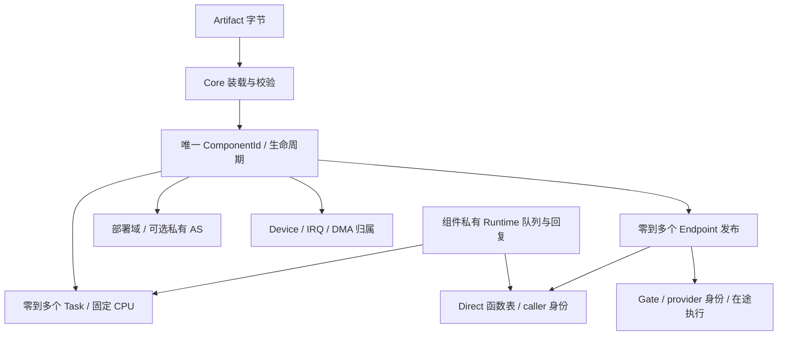

# Core Responsibility & Invariant Audit

本页是 2026-10-08 对 develop 的审计与验证记录，不取代架构契约。
基线：`01ee7c21b86bb362a7e14fdc687ce56c820e33c0`。代码修改获本次任务明确授权。

## Phase 0：事实与职责

| 状态 / 记录 | 保存的事实、修改者与真实消费者 | 重复性 / 必要不变量 | 结论 |
|---|---|---|---|
| `component::Registry` / `ComponentRecord` | Core loader 与生命周期编排写 id、状态、域、AS、loaded、opaque state；调度、调用、资源入口与 monitor 读 | 唯一实例生命周期；id 不复用，失败恢复创建新 id；state 指针不是 Core 所有的堆对象 | 必须保留 |
| `LoadedComponent` / image backing | loader 校验入口、重定位、ABI，实例记录持有驻留 backing | **没有 ComponentImageId / ImageTable**；当前 loaded 与实例 1:1；同一 artifact 多次放段，data/bss 独立 | 保留，不新增共享镜像身份 |
| `EndpointRegistry.endpoints` | Core 提交发布、失效；Gate / bind 读 owner、port、contract、ABI、api/ctx | endpoint 是一次发布，不是另一个 Component；单调 id，旧发布不重定向；只读 SDK handle 不另存存活真相 | 必须保留 owner / 存活 / 执行入口 |
| `contracts` | 首次发布确定 kind / exact ABI，后续发布校验 | 是跨 provider 的 ABI 一致性，不等于 endpoint；诊断 name 无消费者 | 保留一致性校验；删无用 name |
| `names` | Core 提交 `(provider, port_name) → EndpointId`；显式 discover 与 observation 读 | 是派生发现索引；其中 contract 与 endpoint 重复 | 简化重复字段；目录整体暂留 |
| `pending` | create 中 stage，成功批量 commit，失败 discard | 尚无 endpoint id，与 Live/Invalid 不是同一事实；内部 Pending 状态没有构造者 | 保留 staging，删不可达内部状态 |
| `ComponentRecord.inflight` | Gate、policy 准入 / 完成写；Isolated 单栈并发检查读 | 计执行，不计 Direct；原 Stop 不读它 | 必须保留并接入 Stop；复用保护 IRQ |
| `TaskTable` / `TaskRecord` | Core 创建、start、park/unpark、switch commit 写；策略只读快照 | owner 创建后不变；state、home CPU、permit、context、stack 是执行真相；组件 owner 与 task owner 是实例和从属执行流两个事实 | 必须保留 |
| scheduler per-CPU state / `PolicySlot` | Core 持有 current、anchor、IRQ 返回现场、活动 policy endpoint、栈与 busy；scheduler 只提出候选 | task Running(cpu) 与 current 是提交后的执行投影，不能随意删；policy 的栈串行占用不是组件业务锁 | 保留，未发现本次须重写的证据 |
| `RequestContext` / per-CPU containment / current create | Core 边界解析 ambient principal 与 caller-task provenance | Direct 保留 caller 身份，Gate 切 provider 身份；loader fallback 与 guard 是临时执行现场，非第二个 owner 表 | 保留；修正 token / Registry 占位注释 |
| `DeviceTable` | Core claim/release/quarantine，IRQ/DMA 读 | 设备存在性来自不可变 MachineInfo；owner 与 quarantine 是独占 / 复用真相，不重复固件描述 | 必须保留 |
| `IrqTable` | Core 注册/撤销 `(device, resource_index)` route；trap 读 | owner/handler/ctx 是投递事实；取出后仍可能执行，撤销不是回调 drain | 保留，补生命周期准入与在途保护 |
| `DmaTable` / `QUARANTINE` | Core allocation owner、mapping device owner、单调 mapping id；驱动与 failure 使用 | allocation 与 mapping 不同；无 IOMMU / 静默证明时 backing 不复用；普通借入 buffer 未 pin | 保留，修 map 与 device release 竞争；不新增 DMA framework |
| buddy / slab / `MemoryLease` | Core 分配占用与 RAII；loader、栈、页表、heap 后端使用 | 无 region owner / malloc 账本；SDK HeapState 是业务实例自己的 free list，不重复物理分配真相 | 必须保留 |
| `AddressSpaceManager` / handle / mappings / shared root plan | Core 建立 owner、generation、Ready/Retired、权限与 backend；Isolated 和用户执行使用 | 实例 AS handle 是归属关联，AS 表是映射真相；generation 防 stale，shared/exclusions 是实际别名维护 | 必须保留；无远端 shootdown，不能声称完整 SMP AS 回收 |
| SDK `Endpoint<C>` / typed binding / C 与 Rust ABI | SDK 缓存已选机制与类型；schema 生成声明与布局断言 | 不是第二个 registry；C/Rust 唯一来源已是 `abi/*.toml` | 保留生成链，不再另造 ABI 源 |

业务服务名称、provider 选择、RequestId、队列、reply 匹配、取消与并发语义可以外置。
现有 endpoint 目录有真实的 init/ksh/SDK 消费者；本轮不复制成 ServiceManager，也不在
没有迁移原型时拆掉目录。调度契约是 Core 自己消费的机制，保留专用 policy 边界。

## 已确认问题与边界

| 问题 | 代码证据 | 本轮处理 |
|---|---|---|
| Stop 可越过无 owned task 的正在执行 Provider | exit 只查 Task；call 在 registry 中已有 inflight | 同锁检查在途计数与提交 Stopping |
| Direct ctx 可被 destroy 释放 | bind 交付裸 api/ctx，无 unbind；C FS destroy 释放实例状态 | 依据已发布 Direct table 保守拒绝 destroy，不靠代码驻留推导 ctx 安全 |
| IRQ 取出回调后可与 destroy 竞争 | on_irq 锁外调用，route_of 不查实例状态 | 共用实例准入 / 在途计数，不持锁执行回调 |
| DMA map 与 device release 之间有插入窗口 | dma::map 在插入 mapping 前 drop(device_table) | 保持 device→dma 锁序到插入完成 |
| bind 把未实现的 K/I→Sandbox 判断成 Gate | select_mechanism 返回 Gate；dispatch 却 ENOTSUP | 绑定时直接拒绝全部 Sandbox 组合 |
| Resolved 注释暗示已解析依赖 | load 没有 requires / runtime dependency resolver | 说明是装载后、create 前阶段；未实现能力另列 |

零 Task 的被动组件合法；多个 Task 的组件合法；Direct 与 Worker 可以共存，组件自己
负责同步。当前没有“多个实例共享一份已重定位 loaded image”的机制，只有同 artifact
多实例。Isolated 的栈 / AS / ABI 窗口由 Core 建立，业务 instance_state 由组件写回；
单栈入口跨 CPU 串行，Isolated Task 与设备 API 未接通。

Failure 阻断后续调度 / Gate；另一个 CPU 已运行的 KernelNative 代码仍可运行到下个
协作边界。Direct 不切身份、不容纳 provider panic，已持有表不可撤销；必须保持 ctx
存储，组件不得自行释放暴露对象。IRQ release 不证明在途回调已返回。

DMA map 的实现锚在 **device owner**，忽略 ambient ctx；unmap 不解析 caller。这为
现有 VirtIO Direct 服务提供归属，但与 driver-model 的“非 owner map 被拒”文字冲突。
普通 buffer 未做 pin，failure 的资源获取门禁与实际资源插入也没有一个全局事务。
本轮不把这些边界改写成已解决，不靠调整 getter 测试声称权限或 DMA 隔离。

## 分阶段交付与验证

Phase 0 只建立本审计；基线纯 Core host：502 passed、5 ignored（忽略项不是通过）。
后续阶段的变更、命令、规模与实际结果在完成后追加。

## Phase 1：正确性

- Stop 在 registry 准入锁内检查在途执行、Direct 发布与 live Task，再提交 Stopping；
  Gate、policy、IRQ 后续准入均被阻断。组件代码在锁外执行。
- IRQ 复用 inflight，允许 Starting/Ready；回调已取出后撤销 route 不会丢失在途事实。
- Native 发布非空 Direct table 即保守拒绝 destroy，包括 Invalid endpoint 的旧表；
  无新增 pin/refcount 表。Isolated 的表从未通过跨域 binding 外借，不受此限制。
- DMA map 保持 device 锁到子 mapping 插入完成，device release 不能漏掉新子项。
  不改变现有 device-owner 归属与无 caller 的 unmap 规则。
- 唯一新增 ABI 是 `kcore_component_stop(id)`：已有生命周期机制的窄导出，实际消费者
  是 CoreTest 的跨 CPU Stop/Gate 竞争与普通组合方 teardown；不提供测试后门。
  ABI 60→61，exact fingerprint 协调替换，所有旧工件需要重建。
- Core host 507 passed / 5 ignored；`make test-host` 成功（含真实工件 kernel 554
  passed / 6 ignored）。host 竞争检查只证明锁与状态机，不证明 SMP 硬件执行。
- 串口 smoke 的 `unload littlefs` 现在验证 DirectExports 拒绝；多 FS 存活时 ksh cat
  验证现有 ambiguity 拒绝。FAT 文件内容仍由 CoreTest 与普通 init smoke 验证。

## Phase 2：收敛

删除 `ContractRecord.name`（首次发布的端口名被误当契约标签，无消费者）、
`EndpointName.contract`（与 endpoint 相同事实）、内部 `EndpointState::Pending`
（stage 尚无 endpoint id）。必要职责分别由端口名称索引、EndpointRecord、pending
publication 承担；减少两个重复字段与一个不可达状态，不改变隔离边界或 Direct 路径。
公开 wire Pending 编码暂保留用于已有观测 ABI，不声称有生产状态构造者。

KCOMP_ABI 同时生成 C 常量；三个 C provider 与四个无 SDK runtime 的 ArchTest fixture
引用生成物，删除七处需要协调手工同步的生产指纹。Rust fixture 只编入声明，仍无
新 UNDEF/import。独立的 known-answer 测试保留，职责与生成源不同。

Sandbox bind 全部拒绝 ENOTSUP，删除 K/I→Sandbox 的假成功分支；Resolved 与
ComponentId 注释不再暗示已存在 requires resolver、凭证 token 或 ResourceDomain 表。
没有新增 ServiceManager、RPC subsystem、绑定 registry 或 Runtime crate。

本阶段 `make test-host`、RV64 boot-build、RV32 boot-check 成功；纯 Core host
507 passed / 5 ignored。构建使用系统 host linker，避免本机 Nix cc / glibc 混用。

## Phase 3：形态验证与实验发现

`tests/kcomp_checksum` 是一个 test-only 镜像，不是通用 Runtime crate。同一 create
入口读取 config，所有模式只拥有普通 ComponentId、opaque state 与 owned Task：

| 形态 | 状态 / 执行 | 实际验证 |
|---|---|---|
| Passive A/B | 两个实例，各有独立 mailbox / Direct counter，零 Task | task 总数不变、ctx / mailbox 不同、A 调用不改 B；发布后 Stop EBUSY，旧 ctx 仍可用 |
| Active | 一个 provider-owned Worker，单槽 Runtime Request/Reply | 64 次原子发布与回复、拒绝覆盖已预留槽；业务请求不进入 Core |
| Hybrid | 同一个 state / endpoint / Worker；同时 Direct checksum 与 Runtime 请求 | 64 次 Worker 回复与 64 次 Direct 调用；RV64 Worker CPU1 / Consumer CPU0，RV32 同 CPU 协作 |
| Gate-only probe | 零 owned Task，api=NULL | RV64 consumer Task 在 CPU1 执行 provider Gate，CPU0 Stop EBUSY 且 Ready；释放后 Stop 成功、旧 endpoint 拒绝、重新创建身份不同 |

mailbox 的 C-layout u32 全部用 AtomicU32::from_ptr；Acquire/Release 发布请求 / 回复，
计数独立原子更新。不输出 Rust atomic layout，不为组件自动造锁框架。
Consumer 对 provider Worker 执行 unpark 得到 EACCES，Direct 不改变 Task owner。
Worker 的 exit 是组件自己的决定，退出不销毁实例；Direct 发布的实例与 state 驻留。

B/C 只使用现有 Task / yield；没有 Core RequestId、队列、reply 或 waitqueue。
原型限定单 consumer、一个请求槽与受信 Native 共享地址空间；错误路径有超时。
跨 owner wake、通用取消 / Task join 和私有域 Worker 尚不可据此宣称完成。

实验实际发现 RR 的旧“cursor += 1，取候选下标模 N”在候选排除 outgoing 时会饿死
三个 Runnable 中的一个。修复仅在 scheduler_rr：原有每 CPU 游标保存上次 TaskId，
选择升序候选的后继、尾部绕回。不改 Core 候选 / 提交 / 调度 ABI，不新增状态。
原型仍保留三个同时 Runnable 的任务，没有通过顺序停止 Worker 绕过问题。
Host 的动态候选回归检查与真实 RV32 Hybrid 场景均通过。

ArchTest `isolated-domain-service` 原来要求 Native Direct provider 可销毁，现在验证
DirectExports 拒绝；Isolated destroy / satp 恢复仍真实执行。ksh endpoints smoke 检查
驻留 FS 的 Live，而不依赖被拒绝的 unload 产生 Invalid；stale 由生命周期用例证明。
