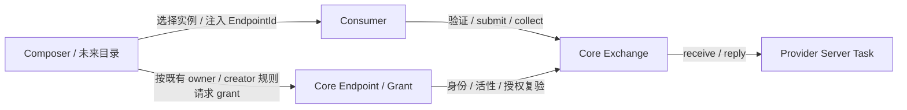

# ADR：IPC 寻址、服务发现与连接编排

> 2026-10-10；**接受设计方向，不实施路由框架**。基线 develop `7e3a3ed1da2e`。
> 传输/授权权威仍是 [IPC](../architecture/ipc.md)、[core ABI](../../abi/core.toml)；
> 退出/重启语义服从[生命周期](../architecture/component-lifecycle.md)。

## Problem

现有普通IPC已有发布身份与真实授权，缺的是多Provider选择与重新连接的组合策略。
把Contract当实例地址会混淆协议和服务，把EndpointId当权限会绕过grant。
网络分层类比用于说明职责，不引入IP地址、路由表、TCP会话或网络协议机制。

## Invariant

- ContractId + exact fingerprint 描述业务协议；EndpointId标识一次provider发布。
- EndpointId可以透传、查询，不自动授予send权限。Task/Component身份由Core验证。
- Provider终止后旧Endpoint永久失效，不重定向到新实例；旧request结果保持首终态。
- 目录只提议Provider；已有grant规则由Core验证，目录不自报owner或creator。
- Provider在自己的Task/AS执行；Core不解码业务Method/Session，不继承caller身份。

## Minimal Change

本轮只有文档。当前目的地址用EndpointId足够：owner/port/contract/exact ABI、listener、
consumer grant与request receipt已经解决单点寻址/权限/回复。无需ConnectionId。

连接编排复用现有流程：

1. Composer加载provider/consumer，以明确ComponentId与端口查询候选Endpoint。
2. 按拓扑、实例配置、用户选择或部署支持面选择一个provider；策略在组件中。
3. consumer用validate/bind验证exact Contract；普通业务只接受IPC binding。
4. provider真实Server Task完成listen后，由owner或其真实创建祖先显式grant consumer。
   目前grant须listener已存在，不能把“config已注入EndpointId”当连接已可用。
5. 把EndpointId经扁平create config或现有业务配置交给consumer，保存生成typed Binding。
6. request直接走`A → Core Exchange → B`；目录不参与每条消息选路。

步骤可依启动依赖调整：consumer可以先收到id，但必须等listen/grant成功再提交。
不存在尚未实现的Core候选枚举ABI承诺；现在可用显式provider+port lookup、已有
只读Endpoint投影。未来目录可以维护自己的策略缓存，但Core EndpointRegistry仍唯一
发布真相，缓存不得成为第二份存活/权限数据库。

未来ServiceDirectory是外置策略Component，只有实际动态选择需求才实现。它若没有
owner/真实创建祖先资格，须请有资格的Composer/provider授权；不能因为发现服务就
在Core获得跨拓扑授权。发现可见性和调用权分别处理；当前只读查询不是不可信目录
访问控制设计，U首阶段只能开放明确支持面，不能从K只读接口推断信息保密。

## Reuse 与案例

| 场景 | 使用现有机制 | 不新增机制的边界 |
|---|---|---|
| 同Contract两个provider | 两个ComponentId/端口生成不同EndpointId；Composer显式选一个 | Core不猜default或负载均衡 |
| 多consumer连同provider | provider/真实创建祖先分别grant；consumer各保存typed Endpoint | grant目前Component粒度，不是逐connection权利 |
| 目录返回id但无授权 | submit EACCES；配置不是凭证 | 目录不自行“补授权” |
| ABI不匹配 | typed validate/bind拒绝；没有兼容协商 | raw submit不带fingerprint，不声称每条raw消息做exact检查 |
| provider退出/重启 | old close、未完成ENOTCONN、已成功结果可collect；重新lookup/validate/grant后换新id | 不自动重放write/open，不迁移旧handle/session |
| caller退出 | Exchange丢结果，accepted receipt按既有纪律退役 | 业务已创建对象由业务协议rollback/reaper |
| selection与provider停止竞争 | 提议可过期，bind/submit按Core真相拒绝；Composer可重新查询 | 不加目录锁跨普通请求，不保证选择瞬间即后续存活 |

Control plane的连接完成只表示授权/验证已建立，不保证provider未来永远存活。
重连是显式配置更新：停用旧Binding，处理旧结果/业务会话，再接新实例。
无副作用查询可由业务决定重试；有副作用请求是否可重放由Contract负责。

## 两个参考方案与取舍

调查日期2026-10-10，仅官方文档，没有复制代码或声称固定源码审计。

| 参考 | 核实事实 | 本项目判断 |
|---|---|---|
| Fuchsia [Protocol capabilities](https://fuchsia.dev/fuchsia-src/concepts/components/v2/capabilities/protocol)，在线页更新2026-09-28 | provider outgoing directory、consumer namespace与显式offer/expose连接策略分开 | 借鉴组合与服务协议分离；拒绝全量component realm/capability routing图/FIDL framework，现creator授权并不等价 |
| QNX Neutrino 8.0 [ConnectAttach](https://www.qnx.com/developers/docs/8.0/com.qnx.doc.neutrino.lib_ref/topic/c/connectattach.html)，页更新2026-06-11 | 连接调用者process与目标channel，返回coid；connection有单独detach/lifetime | coid承担的fd/连接语义本项目无需求；现Endpoint+Component grant已足够，不因QNX有coid而加ConnectionId |

将来出现per-connection不同rights、独立撤销、业务要求有拥有式连接寿命，才重新
评估ConnectionId。先给真实消费者、失效/转移/回收测试和维护成本；当前没有这些需求。

## Removed Complexity / Non-goals

不增加Connection Registry、Capability Graph、第二Endpoint库、逐消息目录转发或
业务Core Session。不给普通业务恢复Direct Function Call。路由不是I/U Runtime前置。
本轮不实现directory/router/fastpath/inline dispatcher/shared buffer/ring/batch/notification。

未来优化保留触发点：batch减少wake；同步IPC fastpath只优化已有真相事务；shared
buffer/ring减少copy；completion/notification改变等待方式；高频I/O分离控制与数据。
每项先测瓶颈和真实需求，再在现授权/AS/Task/Exchange seam扩充。
共享数据通道须说明唯一页owner、各域mapping/外借引用、pending I/O、撤销/drain、
Force时保留、最后引用与TLB确认。Core建立映射/授权、通知/回收仍需可信机制；
共享页不是普通Direct function call，也不能让unload提前free尚在使用的页。

## Tests / Result

现Endpoint host覆盖多实例、exact、stale/no-redirect；Exchange host覆盖grant拒绝、
caller/server退出、首终态。Runtime新增真实K/I/U矩阵和停止回收后，才扩动态编排测试。
设计验收案例列于上表；未建立ServiceDirectory，因此没有虚构目录测试PASS。
**Result：本轮仅ADR，无新增生产维护点/registry/ABI/Wire。**
