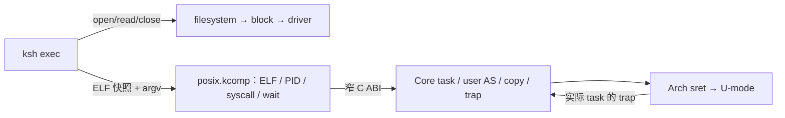

# 用户态、fork/exec 与后续 libc

第一条运行路线是 RV64 / supervisor / MMU / QEMU virt。当前已实现普通静态 ELF
用户程序，尚未实现完整 POSIX、Win32 或 BusyBox。边界与代码见
[POSIX 模块](../modules/posix.md)、[调度契约](../architecture/scheduling.md)。



## 运行与验证

```sh
make exec-fixtures              # .config 选择架构，目前只支持 RV64
make test-host                  # 包含 POSIX ELF / stack / config 与 Core 纯逻辑
make test-qemu                  # RV64/RV32 CoreTest、ksh、默认 init
# 可选的 Linux syscall 模拟参考；不代表 KaleidOS 执行结果
python3 tests/compat/exec_fixtures.py --arch rv64 --linux-reference
```

夹具编译需要 `riscv64-unknown-elf-gcc`；QEMU/真实 FAT 流程需要 qemu-system-riscv64、
dosfstools、mtools。CI 已登记该编译器。Make 的 RV64 init.kpkg 和 clippy 会先构建
夹具；生成物在 `build/exec-fixtures/`，不提交二进制。14 个镜像均为普通 ET_EXEC，
不是 `.kcomp`；多数只用整数，fork/exec 与 timer 还验证浮点现场。

| 场景 | 实际验证 |
|---|---|
| exit-zero / exit-seven / write | 回到调用者，保留 0 / 7 退出码、stdout 字节与 write 返回数 |
| stack-bss | 16 字节对齐、argv/envp/auxv、跨页 BSS 清零 / 可写 |
| bad-pointer | 溢出、Core 地址、跨映射空洞的 write 返回 EFAULT |
| privileged / core-read / text-write / stack-execute / breakpoint | U-mode 权限与进程故障状态；不结束 Core |
| protect | 非法 mprotect 拒绝，实际只读页写入故障 |
| fork-exec + target | 子进程复制 backing / FP；坏 ELF 的 exec 回滚；新 ELF / 栈 / BSS / FP；wait 与 EFAULT / ECHILD |
| timer | 无 ecall 长循环也允许另一个任务运行；回来后整数 / FP 现场保持 |

组件 / 系统集成的唯一编排者仍是 CoreTest，入口在
`os/components/tests/core_test/src/runtime/exec.rs`。QEMU runner 要求 `exec-elf`、
`exec-fork-exec-wait`、`exec-timer` 和整个 CoreTest PASS。
`tests/qemu/init_runner.py` 在 FAT 盘副本放入短文件名 ELF，提交真实 ksh `exec` 命令；
它还验证非法 ELF、进程故障、随后 cat/echo 和 shutdown。无盘分支返回 ENODEV。

手动执行可把同 ISA 静态 ELF 放入实际 FAT 镜像：

```sh
make rootfs
mcopy -o -i build/rootfs.fat build/exec-fixtures/write ::/WRITE.ELF
make qemu
# ksh> exec 0:/WRITE.ELF
# EXEC_WRITE_OK
# exec: exit=0
```

当前 FatFs 配置使用短文件名；示例用 8.3 名称。shell 参数不支持引号 / 展开 / 管道。
读取 ELF 使用真实 FS，POSIX 此 profile 的 execve 则只查显式配置的镜像集合。
单镜像 ksh profile 的 key 是 `/main`；不能据此声称一般的路径 / cwd / VFS 已接通。

## Core 与 POSIX 的执行接缝

Core `task/user.rs` 拥有 task↔AS、U 映射、全部整数与浮点现场、实际 trap 来源；
`abi/core.toml` 的 `kcore_user_*` 是创建、映射、初始化、准备、copy、进入、clone、
replace、protect、discard 的窄 C ABI。Core 不解释 Linux syscall 号或 PID。

每个用户 task 在 POSIX 的 KernelNative 任务入口中同步进入 U-mode。ecall / fault /
到期 timer 恢复该 task 的内核栈与 kernel satp；POSIX 再处理 syscall / yield / park。
用户 copy 全范围逐页验证实际 U 映射和读写权限后才通过 Core alias 复制，不打开 SUM。
fork 深拷贝；exec 和 mprotect 构造完整新 AS 后提交，失败保留旧 AS。

一个 POSIX 组件实例管理进程族，族内 task 都有自己的 AS，不以 PID 冒充 ComponentId。
进程族固定 CPU，状态 observer 只读原子字段。wait 在真实 task 栈 park，子进程退出
经同 owner 的 unpark 唤醒。退出 / 成功替换的已发布 backing 保持驻留，尚无 COW 或
完整物理回收。POSIX 选 10ms 用户执行界限，Core timer 保留已有更早 deadline；
这没有实现 KernelNative 组件任务的通用抢占。

普通用户 task 与 SandboxedNative `.kcomp` 是两条装载路径：后者仍未接 U-mode imports /
Core ecall SDK / 私有 heap / lifecycle，组件装载仍返回 ENOTSUP。

## 下一步：上游 libc 与文件语义

上游 libc-test 的参考运行与组合包见 [compat-testing.md](compat-testing.md)。
RV64 静态 glibc `compiler/udiv` 已实际从 FAT 装载，但启动终止；日志暴露缺失的
uname、openat、writev、mmap、signal 等 syscall。当前不将这些缺失行为翻译成成功，
也不宣称任何上游 libc-test 已在 KaleidOS PASS。

后续按实际二进制逐项补 startup / TLS / 系统信息 / 内存 / 信号，再运行 shared C
用例。文件用例 fdopen/stat 另需真实 FS → VFS → POSIX fd；现有 FS API 缺 node /
lookup / read_at，VFS 仍是骨架。先实现只读 namespace、独立 open 游标与引用，再补
写入、目录、dup、pipe、terminal。已有 FAT / littlefs / block provider 无需重写。

Win32 后置：还需 PE loader、DLL imports、Win32 API / HANDLE，与用户执行机制可共用。
当前 Windows 参考包是 x86_64，不能在 RV64 CPU 直接执行；共用测试源码不等于共用
不同 ISA 的二进制。BusyBox applet 同样需要对应的真实 syscall / VFS，不只需要静态链接。
