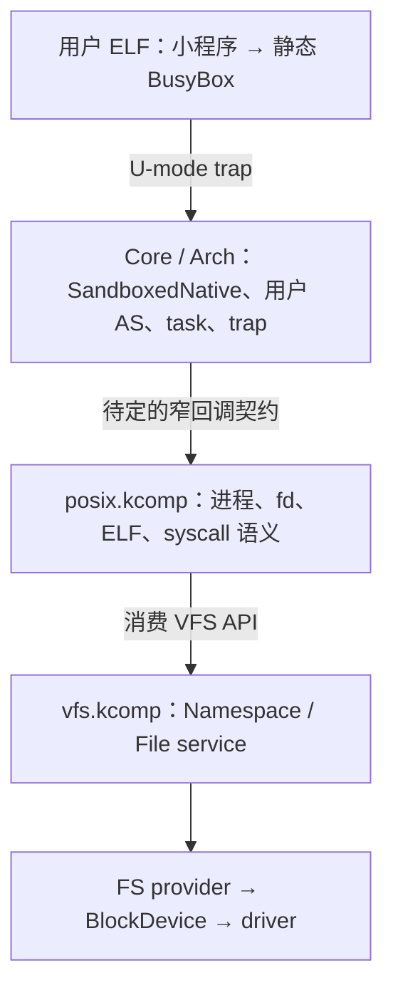

# 用户态与 BusyBox 的实施顺序

> 计划与手写入口，不是已实现能力或新增 Core 契约。状态以 `STATUS.md` 为准；
> 执行域契约以 `docs/architecture/deployment.md`、
> `docs/architecture/driver-model.md` 为准。第一条验证路线选择 RV64 / MMU / QEMU virt。

## 组合关系

SandboxedNative 是 Core 的执行域，不构建 sandbox.kcomp。POSIX 默认是消费者，
不发布业务 service；Core 如何交付用户 trap 要另定窄 C ABI。用户 ELF 也不是
`.kcomp`：POSIX 解释程序格式，Core 验证并提交映射 / task / 执行现场。

当前落点为 Core `component/sandbox.rs`、VFS `filesystems/vfs/`、
POSIX `personalities/posix/` 和 SDK 的 `vfs` / `posix` 声明。全部为占位。
Sandbox 创建在装载前返回 ENOTSUP；U-mode 进入、copy、trap 路由与销毁尚未实现。

## 阶段与验收

| 阶段 | 手写范围 | 验收 |
|---|---|---|
| 1：只读 VFS | provider 的 root / node / lookup / 引用 / readlink / 枚举 / read_at；VFS 表、授权 / share、SDK Direct/Gate adapter | 真实 FS → VFS → consumer；路径引用、独立 open 游标、dup 共游标、EOF / 短读、旧实例失效 |
| 2：Core 用户执行域 | task↔AS、U 权限映射、用户栈、trap 返回、Core ecall、用户范围 copy、故障逻辑退役 | 真实 U-mode 小探针；拒绝访问 Core / 其他域、拒绝特权指令、坏指针不破坏 Core、fault 不结束其他实例 |
| 3：POSIX 小程序 | 用户 trap 路由、进程 / fd、Console、静态 ELF 段与 argc/argv/envp/auxv、最小 syscall | 先 freestanding write/exit，再静态 libc hello；确认实际为 U-mode，有真实 task / AS |
| 4：静态 BusyBox applet | 按实际二进制补 Linux syscall 子集 / stat 布局 / 内存与目录操作，VFS 数据与控制台 I/O | 独立运行 true / echo，再 cat / ls；记录未实现 syscall，明确拒绝 |
| 5：shell | 多进程 / spawn 或 fork-exec、wait、pipe、终端、阻塞完成、signal 与所需调度机制 | 能执行命令、等待退出、重定向和管道；再增加选定 applet |

阶段 1 / 2 可以分别推进；阶段 3 同时依赖用户执行域与基本服务。Console 需要真实
输入 / 输出契约，不能将 kcore_log_line 伪装成 fd 1。BusyBox applet 的具体 syscall
集合由选定构建及实测决定，不从 POSIX API 名字推断。

CoreTest / ArchTest 的新用例走真实 Core API；夹具如后续确有需要，放测试目录。
本阶段只调整现有 host 拒绝路径检查，不构建或登记 sandbox 测试组件。

## 在写 Core 机制前需要定稿的接缝

1. 用户 task 对 AS 的关联与调度提交：由 Core 验证真实 owner / 状态；不能由 POSIX
   直接写 task 状态、页表或复制 Isolated S-mode trampoline 作为 U-mode 实现。
2. 用户 trap 的交付 / 返回：来源必须来自 Core 当前 task，不能信任寄存器中的 pid。
   Linux syscall 号、fd 和 errno 由 POSIX 解释；Core 不内建 Linux dispatcher。
3. Sandboxed 组件的 Core mechanism ecall 与用户程序的 personality syscall 是不同契约。
   路由依据真实执行上下文，不能仅凭任意用户操作号冒充另一类调用。
4. 用户指针 copy：按实际 AS 的映射 / U 权限逐页校验，处理溢出、fault、并发 unmap；
   不依赖 SUM，也不将 user VA 直接 cast 为共享内核引用。
5. 阻塞与完成：Gate service stack 禁止 park；用户 read / wait 的等待协议、跨 owner
   完成通知须单独定稿。服务返回后如何唤醒正确用户 task 仍是机制缺口。
6. 原生权限 / Linux 错误映射与装载策略：不把不支持的语义翻译成成功。
   POSIX 进程身份与 ComponentId 的关系、多个进程 AS 的归属仍需设计。
7. Sandboxed 组件的按域装载 / import：SDK 的 Core 调用需接 U-mode ecall 后端，
   不能解析到 KernelNative 裸函数地址；堆使用本执行域后端，不导入共享 Core heap。

这些接缝在 Core 与组件边界间另定 schema，不通过 Rust enum / trait / 编译器结构传递。

## BusyBox 构建目标

先选静态 ELF 的少量 applet，避免首个目标同时要求动态 linker 与 shell。
BusyBox 支持静态构建，且 standalone shell 也有额外运行环境要求；参见
[BusyBox 官方 FAQ](https://busybox.net/FAQ.html)。静态链接只减少装载依赖，
并不取消 libc / Linux syscall 与启动栈要求；musl 自身是面向 Linux 的 libc，
参见 [musl 官方介绍](https://wiki.musl-libc.org/)。

后续若引入 BusyBox / libc，使用 `third_party/` git submodule；构建目标与选择由
Kconfig / `.config` 驱动。当前没有下载第三方源码、创建 BusyBox target 或承诺版本。
